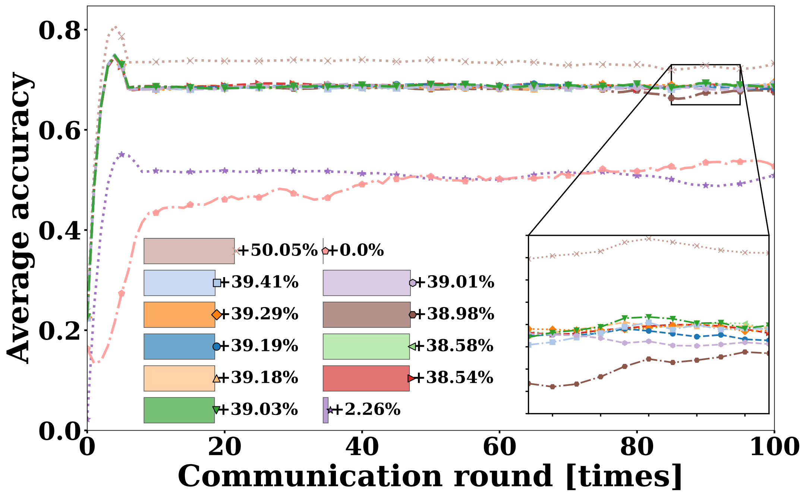

# PIFCA: Efficient Federated Clustering with Gradient Search Optimization for Medical Edge Networks 🔥🔥🔥

<p align="center">
  
</p>


## Table of Contents
- [Overview](#overview)
- [Datasets](#datasets)
- [Running Experiments](#running-experiments)
- [Results](#results)
- [Acknowledgements](#acknowledgements)

## Overview 📖📖📖
PIFCA (**Preliminary Iterative Federated Clustering Algorithm**) addresses **statistical heterogeneity** in federated learning by clustering clients early in training using **gradient-space search**.
Unlike traditional similarity-based methods that require stable gradients or fixed thresholds, PIFCA constructs a **privacy-preserving synthetic sampling dataset** and evaluates multiple client-cluster combinations via **gradient combination accuracy and entropy**.
Through iterative search, it locks optimal cluster assignments in a **single-step operation**, improving both **accuracy** and **communication efficiency** in highly non-IID environments.

**Key Features:**
- Early clustering using unstable gradients via synthetic sampling.
- Gradient combination search for optimal group allocation.
- Scalable to large client numbers and dynamic user participation.
- Plug-in capability to enhance existing FL algorithms.

---

## Datasets 📊📊📊
We use three datasets from **MedMNIST** and two **CIFAR datasets** for experiments:
- **DermaMNIST**
- **BloodMNIST**
- **OrganAMNIST**
- **CIFAR-10**
- **CIFAR-100**

### Data Partitioning
We partition datasets among clients using a **Dirichlet distribution** (α = 0.1, 1, 100):

|  |  |  |
|:------------------------:|:--------------------:|:-------------------------:|
| α = 0.1                  | α = 1                | α = 100                   |

<p align="center">Data distribution of five clients under different Dirichlet coefficients.</p>

### Synthetic Sampling Dataset
To evaluate clustering performance without exposing real data:
1. **Randomly sample** a portion of images from each client.
2. Use **CycleGAN** to generate a **synthetic dataset**.
3. Preserve statistical patterns while protecting privacy.
4. Use the synthetic dataset to evaluate **accuracy** and **entropy** in early rounds.

<p align="center">
  <br>
  Sampling vs. Original Distribution — partial biased sampling retains true distribution information.
</p>

---

## Running Experiments 🧪🧪🧪

### PIFCA
```bash
# Example: OrganAMNIST dataset, α=0.1
python main1.py -data OrganAMNIST_0.1 -m CNN -algo Local -gr 100 -lr 0.001 -ncl 11 -dev cuda -did 0,1
```

Alternatively, define multiple experiments in `sh1-1.py` and run:
```bash
python sh1-1.py
```

### Baseline Algorithms
```bash
python sh1-1.py  # Runs predefined baselines with stored datasets
```

### Cluster Partitioning
- `PIFCA-de.ipynb` → DermaMNIST clustering  
- `PIFCA-or+bl.ipynb` → OrganAMNIST & BloodMNIST clustering  
- Pass clustering results into `serveravg_test.py` and set:
```python
a = [1, 1, 1, 1, 1, 0, 0, 0, 0, 1]  # Same label for clients in the same cluster
```

---

## Results 🏆🏆🏆

|  |  |  |
|:------------------------:|:--------------------:|:-------------------------:|
| BloodMNIST α = 0.1        | BloodMNIST α = 1     | BloodMNIST α = 100         |

|  |  |  |
|:------------------------:|:--------------------:|:-------------------------:|
| Cifar-100 α = 0.1         | Cifar-100 α = 1      | Cifar-100 α = 100          |

|  |  |  |
|:------------------------:|:--------------------:|:-------------------------:|
| OrganAMNIST α = 0.1       | DermaMNIST α = 1     | Cifar-10 α = 100           |

### Accuracy under α = 0.1 (Highly Non-IID)
| Dataset       | Best Baseline | PIFCA  | Gain   |
|---------------|--------------|--------|--------|
| DermaMNIST    | 70.42        | 74.28  | +3.86% |
| OrganAMNIST   | 61.75        | 71.55  | +9.80% |
| BloodMNIST    | 82.90        | 87.82  | +4.92% |
| CIFAR-10      | 44.71        | 51.74  | +7.03% |
| CIFAR-100     | 21.84        | 26.75  | +4.91% |

### Accuracy Performance Analysis
PIFCA consistently outperforms all 11 baseline methods under highly non-IID settings (α = 0.1).  
- **Medical datasets** (DermaMNIST, OrganAMNIST, BloodMNIST) show significant improvements, with the largest gain of **+9.80%** on OrganAMNIST.  
- **General image datasets** (CIFAR-10, CIFAR-100) also benefit, with accuracy increases of **+7.03%** and **+4.91%** respectively.  
- The performance gain is attributed to **early clustering** via gradient-space search, which mitigates the negative impact of extreme label imbalance.

These results highlight PIFCA’s **robustness** and **adaptability** in heterogeneous federated learning environments, especially when client data distributions are highly skewed.

---

## Acknowledgements 🙏🙏🙏
- Code framework adapted from [PFLlib](https://www.pfllib.com/docs.html)
- Dataset source: [MedMNIST](https://medmnist.com/)

